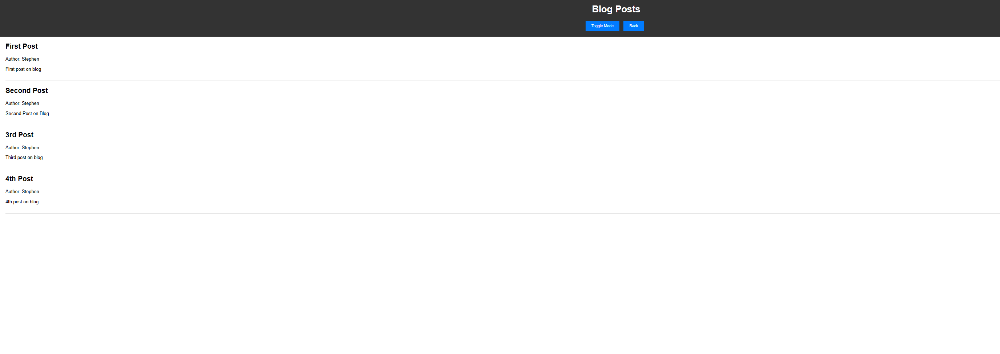

# Project Name

Stephen's First Blog

## Description

This is a two paged website where someone can create a blog post with a username, title for their post, and a post with content they'd like to share. on the primary page you are shown a form to fill out. on the second page the blog is shown as well as previous posts. There is also an option for light/dark mode.

## Screenshots

## Link

https://scoops113.github.io/Stephen-first-blog/

## License

This project is licensed under the MIT License - see the [LICENSE] file for details

